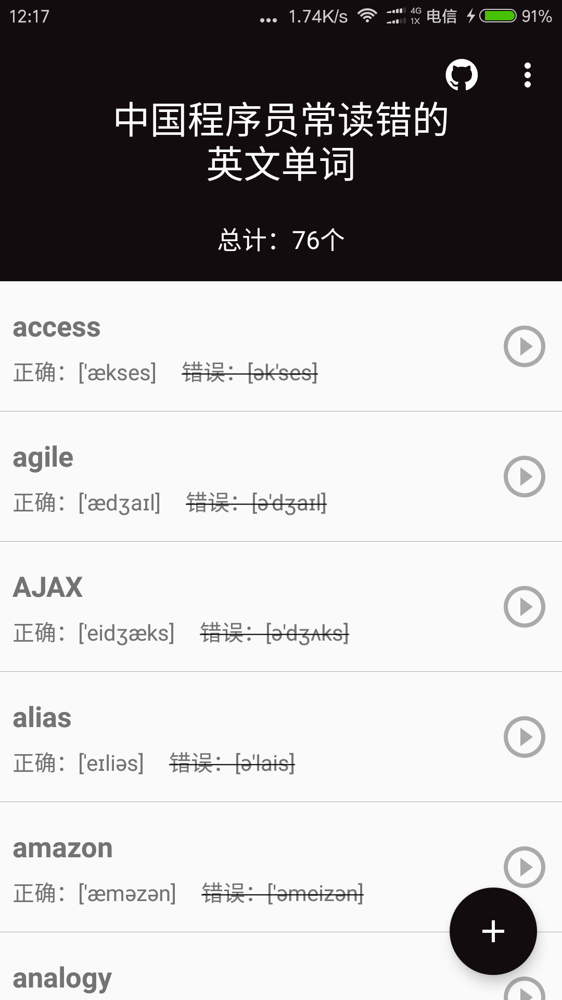

## 花灰 ##

iOS 版本请前往 [https://github.com/lexrus/Huahui](https://github.com/lexrus/Huahui)

这个项目是 『中国程序员常读错的英文单词的 App』 的 Android 版本，简单粗暴。

陈列了一些中国程序员经常读错的单词，纠正发音！使用原生 MediaPlayer 播放网络单词音频，没有其他多余功能了。

### 下载 

[直接下载](http://7xp1a1.com1.z0.glb.clouddn.com/HuaHui/huahui_v1.0_20170303.apk)

### 截图 ###

### 特别感谢 ###
- [花灰 iOS](https://github.com/lexrus/Huahui) 提供开发灵感
- [中国程序员容易发音错误的单词](https://github.com/shimohq/chinese-programmer-wrong-pronunciation) 提供单词列表

### 开源库 ###
- [BaseRecyclerViewAdapterHelper](https://github.com/CymChad/BaseRecyclerViewAdapterHelper)

### 联系我 ###
* Email:[me@liyuyu.cn](mailto:me@liyuyu.cn)
* Weibo:[@呵呵小小鱼](http://weibo.com/u/1241167880)